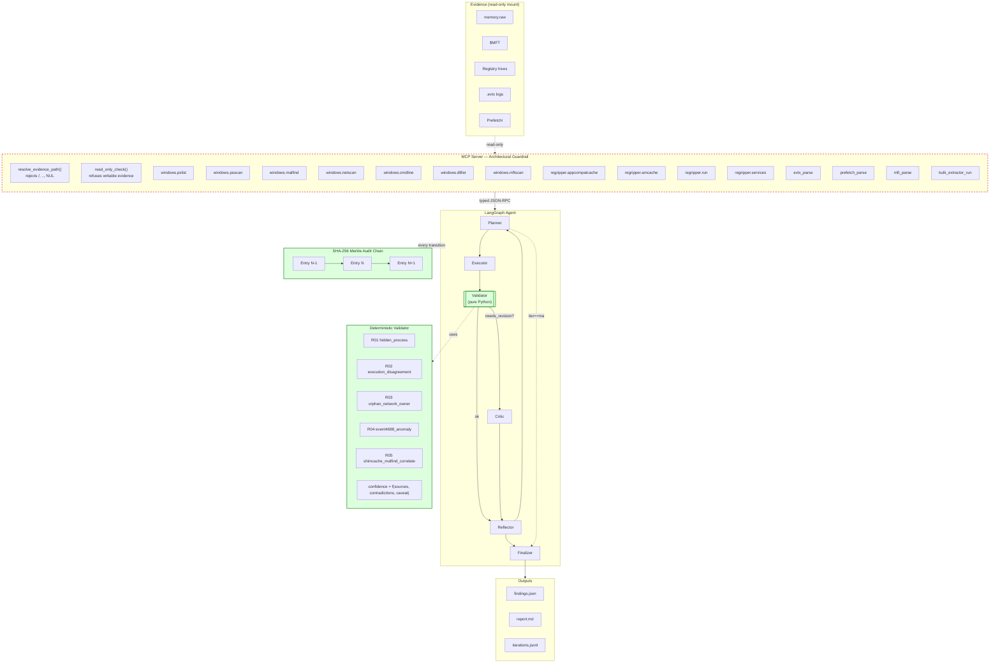

# ECHO Architecture

## High-level topology



**Legend:**
- 🟥 **Red dashed border** = security boundary (the agent cannot cross
  this wall — there is no shell or eval beyond it).
- 🟩 **Green border** = pure-Python deterministic logic (no LLM calls).

## Why this topology wins

### Three layers, three different trust levels

1. **MCP server** = trusted code, narrow API, exhaustive input validation.
   The agent connects via stdio JSON-RPC and sees ONLY 14 typed callables.
2. **Deterministic validator** = trusted code, set-diff arithmetic over
   typed Pydantic records. Cannot hallucinate. Output is a list of
   `Contradiction` objects with rule_ids R01–R05.
3. **LLM nodes** = untrusted output, schema-constrained via Ollama
   `format=<json_schema>`. Every LLM response is validated by Pydantic
   before being applied to state.

### The cycle: planner ↔ executor ↔ validator ↔ (critic|reflector)

| Node | Reads | Writes | Uses LLM? |
|---|---|---|---|
| Planner | EchoState | next phase | Yes (schema-bound) |
| Executor | phase + allowlist | tool_cache, last_output | Yes (schema-bound) |
| Validator | tool_cache | contradictions, needs_revision | **No** |
| Critic | latest contradiction | tool_cache, last_call | Yes (schema-bound, action ∈ {rerun, accept_low_conf, escalate}) |
| Reflector | iteration outcome | reflection_memory | Yes (schema-bound) |
| Finalizer | tool_cache + audit head | findings, report | Yes for proposals; **deterministic for confidence** |

Termination is enforced by **three caps** (any one trips → finalize):
- `iter ≥ max_iter` (default 8)
- `tokens_used ≥ budget_tokens` (default 60 000)
- wall-clock seconds since start > `wall_clock_max_seconds` (default 900)

Plus a graph-level `recursion_limit = max_iter * 8 + 10`.

### The audit chain

Every node transition writes one `ChainEntry`:

```
ChainEntry {
    iter, ts, case_id, node, phase,
    input_hash  = sha256(canonical_json(state_before))
    output_hash = sha256(canonical_json(state_after))
    tool_call, tool_result_summary, validator_result,
    tokens_used, produced_finding_id,
    prev_hash   = previous entry's this_hash
    this_hash   = sha256(canonical_json(entry_no_this_hash) || prev_hash)
}
```

`echo verify --case-id <X>` walks the JSONL and recomputes every hash. A
single byte changed anywhere — even in a comment field — breaks the chain.

### Confidence formula (deterministic)

```python
score = clamp(0.30
            + 0.20 * min(sources_count, 4)
            - 0.30 * contradictions_count
            - 0.10 * (1 if has_caveat_high else 0),
              0.0, 1.0)

label = HIGH   if score >= 0.75
else  MEDIUM   if score >= 0.45
else  LOW
```

A finding with one source and an unresolved R01 contradiction
**cannot** be HIGH:

```
sources=1, contradictions=1 → score = 0.30 + 0.20 - 0.30 = 0.20 → LOW
```

A `Pydantic` `model_validator` enforces that `{confidence: low,
status: confirmed}` is unrepresentable in the type system.

## Path safety (architectural)

`resolve_evidence_path(case_id, relpath)` is the only function that can
turn a (case_id, relative_path) pair into an absolute filesystem path.
It rejects:

| Input pattern | Outcome |
|---|---|
| `relpath` starts with `/` | `PathSafetyError` |
| `relpath` contains `\x00` | `PathSafetyError` |
| `relpath` contains `..` after normalization that escapes case dir | `PathSafetyError` |
| `case_id` empty | `PathSafetyError` |
| `case_id` matches `r"^[A-Za-z0-9_\-]+$"` failing | `PathSafetyError` |
| Resolved path not under `CASE_ROOT/case_id/` | `PathSafetyError` |
| Resolved path is writable | `ReadOnlyViolation` |

Every test in `tests/spoliation/` exercises one of these branches.

## Tool surface (locked at 15)

```
volatility:    pslist, psscan, malfind, netscan, cmdline, dlllist, mftscan
regripper:     appcompatcache, amcache, run, services
disk artifact: evtx_parse, prefetch_parse, mft_parse, bulk_extractor_run
```

`tests/spoliation/test_010_tool_registry_has_exactly_15_or_fewer` asserts
this number on every CI run.
